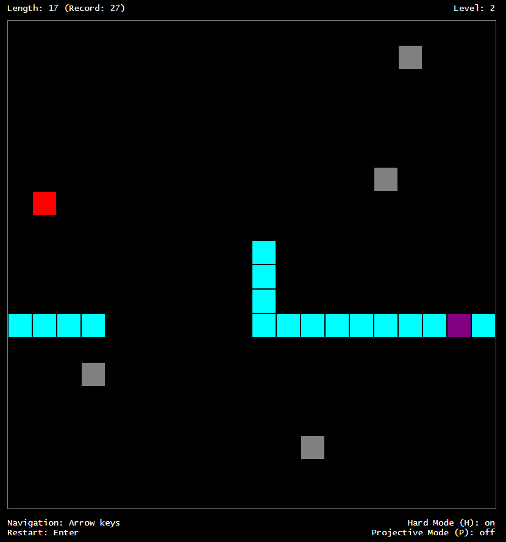

# Snakey

Demo: https://ypby7.csb.app/

A snake-like Browser game with some extra features:

-   The canvas is periodic. So when the snake reaches the boundary of the canvas, it comes out from the other side. Mathematically, we are on a torus.
-   Thus, the snake only dies when it intersects itself (or hits a block, see below).
-   By pressing P or p, you can play the game on a projective plane instead. That means the position is 'inverted' as well when the snake passes the boundary of the canvas.
-   By pressing H or h, hard mode is enabled. This means that on a regular basis, blocks appear which the snake has to avoid. Also, the apples are recreated on a regular basis (not just after eating them).
-   Each time the length has increased by 10, the level increases, which also means that the color of the snake changes.

Sound credits:
http://soundbible.com/1682-Robot-Blip.html /
http://soundbible.com/2067-Blop.html
